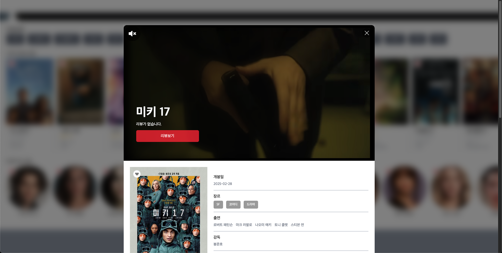
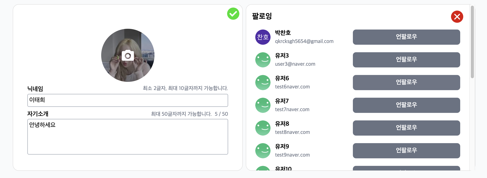
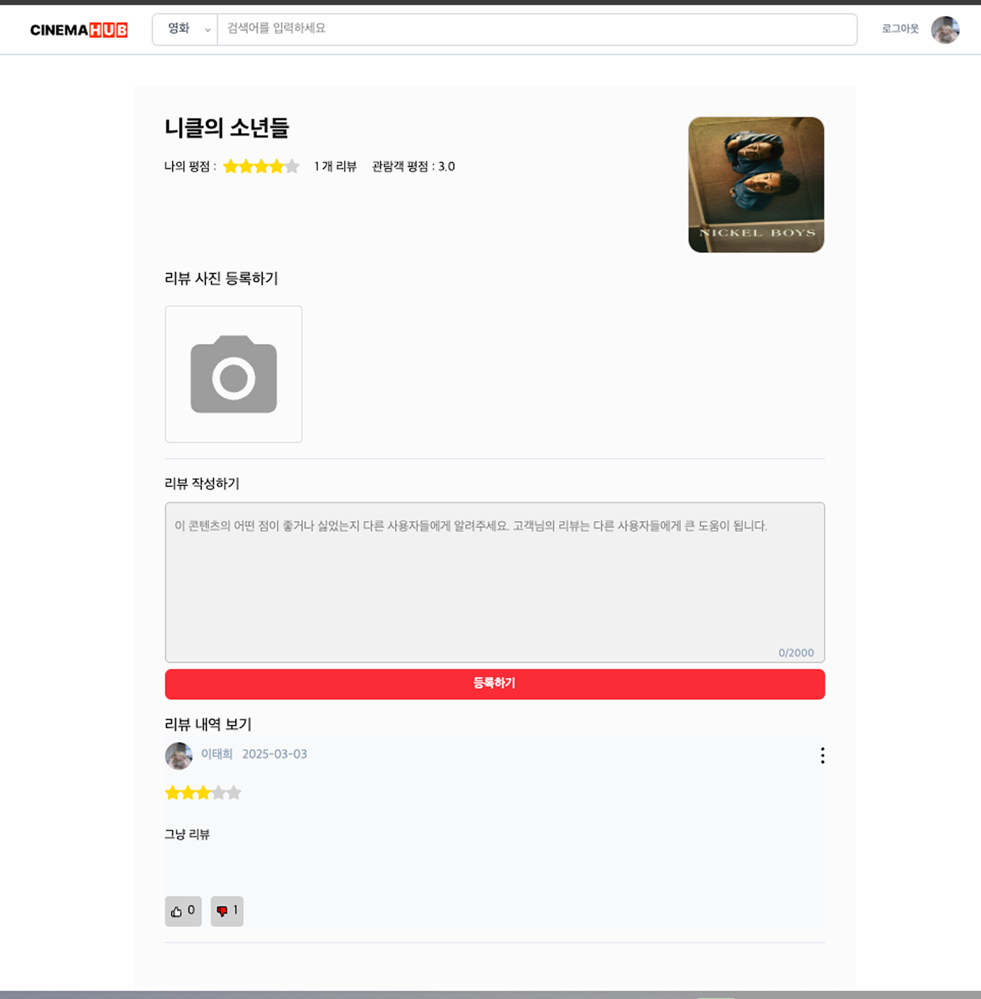

# 🎬 Cinemahub - 영화 커뮤니티 플랫폼

> 영화 정보 조회, 즐겨찾기, 리뷰, 팔로잉 기능이 있는 영화 애호가를 위한 커뮤니티

> 🔗 [배포 링크 바로가기](https://web-cinemahub-front-m88gjvsd5fb295a9.sel4.cloudtype.app/)

## ⏱️ 프로젝트 개요

- 기간: 2025.02.11 ~ 2025.03.05 (3주)
- 인원: 4명(프론트,백 같이)
- 담당 역할: - AWS S3 이미지 업로드, 즐겨찾기 기능 (추가, 삭제, 조회), 프로필 관리 기능 (조회, 수정, 다른 유저 프로필 포함), 팔로잉 기능 (추가, 삭제, 조회)

## 📌 프로젝트 소개

**Cinemahub**는 영화에 대한 정보를 조회하고, 즐겨찾기를 추가하며, 사용자 간 소통이 가능한 **영화 커뮤니티 플랫폼**입니다. 기존의 영화 리뷰 사이트와 유사한 구조를 바탕으로, 유저 간 **팔로잉, 즐겨찾기 공유, 프로필 커스터마이징 등 커뮤니티 중심 기능**을 강화하였습니다.

## 🛠️ Skills

- **Frontend**: React, TypeScript, Tailwind CSS, Zustand, React Router
- **Backend**: Node.js, Express, MongoDB
- **DevOps / Infra**: AWS S3 (이미지 업로드), Cloudtype
- **Design**: Figma

## 👨‍💻 주요 기능

### ✴️ 영화 정보 제공 & 검색

- 인기 영화 및 인기 배우 순위 제공
- 영화 및 영화인(배우) 상세 정보 확인
- 키워드 기반 영화 및 배우 검색 기능

### ✴️ 즐겨찾기 기능

- 영화 및 배우 즐겨찾기 추가 / 삭제 / 조회
- 즐겨찾기 리스트 확인 가능

### ✴️ 리뷰 기능

- 영화 리뷰 작성 / 수정 / 삭제 기능
- 유저 간 리뷰 내용 열람 가능

### ✴️ 신고 및 관리자 기능

- 리뷰 신고 기능 (사유 입력 포함)
- 관리자는 신고된 리뷰 목록을 확인하고 상태를 변경할 수 있음
- 유저 관리 기능 (관리자가 유저 정보를 확인하고 조치 가능)

### ✴️ 유저 프로필 및 커뮤니티 기능

- 내 프로필 및 다른 유저의 프로필 조회
- 유저 간 팔로우 / 언팔로우 기능
- 내가 즐겨찾기한 콘텐츠 및 리뷰 내역 공유

## 📷 주요 ui

- 로그인 페이지

  

- 메인 페이지

  

- 영화 상세 페이지

  

- 영화(인) 검색 페이지

  

- 유저 프로필 페이지

  <div style="display: flex; gap: 16px;">
    
    
  </div>

- 리뷰 페이지

  

---

## 📂 프로젝트 실행 방법

```bash
# [프론트엔드]

npm install
npm run dev

# [백엔드]

npm install
node index.js
```
